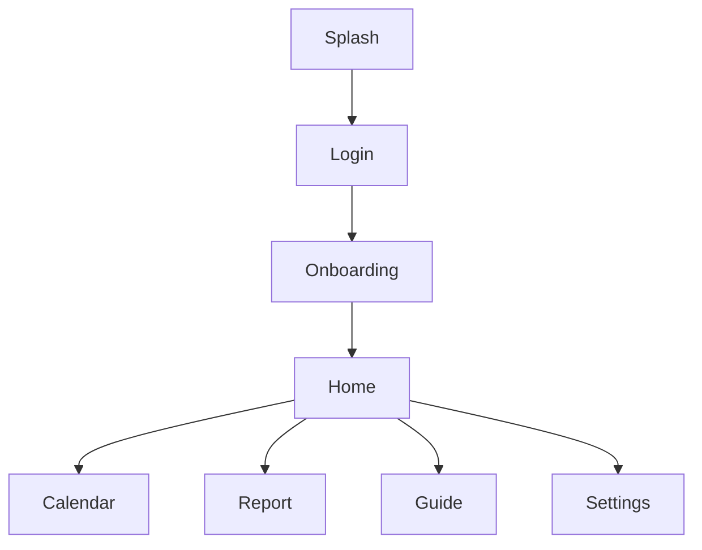

<details open>
<summary><b>📚 목차</b></summary>
  
- [📌 프로젝트 소개](#-프로젝트-소개)
- [👥 팀원](#-팀원)
- [💁 역할분담](#-역할분담)
- [🛠 기술 스택](#-기술-스택)
- [👷‍♀️ 시스템 아키텍처](#system-architecture)
- [📁 폴더 구조](#-폴더-구조)
- [🖥 화면 목록 및 플로우](#-화면-목록-및-플로우)
- [🌿 Git 컨벤션](#-git-컨벤션)
  - [브랜치 전략](#1-브랜치-전략-main-develop-feat)
  - [브랜치 네이밍 컨벤션](#2-브랜치-네이밍-컨벤션)
  - [커밋 컨벤션](#3-커밋-컨벤션)
  - [브랜치 병합 & 기본 규칙](#4-브랜치-병합merge--기본-규칙)
- [📄 협업 템플릿](#-협업-템플릿)
  - [PR 템플릿](#pr-템플릿)
  - [Issue 템플릿](#issue-템플릿)

</details>


# BOOGLE


## 📌 프로젝트 소개

**기억**이 아닌 **기록**으로 내 장 건강을 확인하세요💩

> 부글은 사용자가 배변 상태와 생활 패턴을 간편하게 기록하고, 누적된 데이터를 바탕으로 나만의 장 컨디션 패턴을 확인하며 생활 습관을 조정할 수 있도록 돕는 pwa 웹앱 서비스입니다!

### 🏹 목표
- 배변·생활 데이터를 구조화된 방식으로 기록하게 하고, 이를 시각화하여 사용자가 **스스로 패턴을 인식**하게 한다
- 의학적 근거(브리스톨 척도, 질병관리청, NIDDK) 기반의 룰 테이블로 개인 패턴을 자동 감지하고, **진단이 아닌 생활 습관 개선 가이드**를 제공한다
- 기본 기록 30초 완료를 목표로 한 간편 UX로 **지속적인 기록 습관 형성**을 유도한다
- 병원 방문 시 참고할 수 있는 **PDF 리포트**를 제공해 실질적인 의료 연계 가치를 제공한다

### 🧑‍🤝‍🧑 타겟 유저
- 장 건강에 관심 있는 **20~30대 대학생·직장인**
- 변비, 과민성 대장 등으로 불편을 반복적으로 느끼는 사용자
- 건강 관리 루틴을 만들고 싶지만 기록 습관이 없는 사용자
- 병원 방문 전 자신의 상태를 데이터로 정리하고 싶은 사용자
- 장 기능이 비교적 정상이지만 컨디션을 꾸준히 확인하고 싶은 사용자


<br/>

## 👥 팀원

<table>
  <tbody>
    <tr>
      <td align="center"><a href="https://github.com/lycheelove">@lycheelove</a></td>
      <td align="center"><a href="https://github.com/zio0225">@zio0225</a></td>
      <td align="center"><a href="https://github.com/yuuumh">@yuuumh</a></td>
      <td align="center"><a href="https://github.com/Sohoo122">@Sohoo122</a></td>
    </tr>
    <tr>
      <td align="center"><a href="https://github.com/lycheelove"></a></td>
      <td align="center"><a href="https://github.com/zio0225"></a></td>
      <td align="center"><a href="https://github.com/yuuumh"></a></td>
      <td align="center"><a href="https://github.com/Sohoo122"></a></td>
    </tr>
    <tr>
      <th align="center">리치/김시연 (FE 팀장)</th>
      <th align="center">지오/김지오 (FE 팀원)</th>
      <th align="center">곤/유민형 (FE 팀원)</th>
      <th align="center">호수/이수호 (FE 팀원)</th>
    </tr>
  </tbody>
</table>


<br/>

## 💁 역할분담

| 팀원     | 초기 세팅                                                                   | UI 구현          | 기능 구현                |
| ------ | ----------------------------------------------------------------------- | -------------- | -------------------- |
| **리치/김시연** | CI/CD 및 Vercel 배포 환경 구축<br>Tailwind CSS Reset · Global Style · Theme 설정 | 로그인 · 온보딩<br>홈 | 로그인 · 온보딩<br>홈<br>설정 |
| **곤/유민형** | 프로젝트 폴더 구조 설계<br>절대 경로 설정<br>PWA 환경 설정                                  | 알림<br>설정       | 알림<br>부글 기록<br>리포트   |
| **지오/김지오** | ESLint · Prettier 설정<br>Router 초기 설정                                    | 리포트<br>가이드     | 생활 기록                |
| **호수/이수호** | TanStack Query 초기 설정<br>Axios Instance 설정                               | 캘린더<br>기록      | 캘린더<br>가이드           |


<br/>

## 🛠 기술 스택

| 구분 | 기술 스택 |
| :--- | :--- |
| **프론트엔드** |    |
| **상태 관리** |   |
| **스타일링** |  |
| **네트워킹** |  |
| **패키지 매니저** |  |
| **배포** |  |


<br/>

<a id="system-architecture"></a>
## 👷‍♀️ 시스템 아키텍처


<br/>

## 📁 폴더 구조

```
project-root
├── public
│   └── icons
└── src
    ├── layout # 🧱 공통 레이아웃 컴포넌트 (Header, Footer 등)
    │   └── 📄 Navigation.tsx
    ├── pages # 📄 라우팅 페이지 디렉토리
    │   ├── calender # 캘린더 페이지
    │   ├── guide # 가이드 페이지
    │   ├── home # 🏠 기본 홈페이지
    │   │   ├── apis
    │   │   ├── components
    │   │   ├── constants
    │   │   ├── hooks
    │   │   ├── types
    │   │   └── utils
    │   ├── login # 로그인 페이지
    │   └── report # 리포트 페이지
    ├── routes # 🗺️ 라우팅 설정
    └── shared # ♻️ 전역 공통 코드
        ├── apis # 공통 API 함수
        ├── assets # 정적 리소스 (이미지, 아이콘 등)
        ├── components # 재사용 가능한 공통 컴포넌트
        ├── constants # 공통 상수
        ├── hooks # 공통 커스텀 훅
        ├── styles # 전역 스타일 및 테마
        ├── types # 공통 타입 정의
        └── utils # 공통 유틸 함수
```

<br/>


## 🖥 화면 목록 및 플로우

| 화면 | 설명 |
| :--- | :--- |
| 🔐 로그인 | 소셜 로그인 및 회원가입 |
| 👤 온보딩 | 사용자 정보 입력 |
| 🏠 홈 | 오늘의 배변 기록 및 요약 |
| 📅 캘린더 | 날짜별 배변 기록 조회 |
| 📊 리포트 | 주간/월간 리포트 및 PDF 다운로드 |
| 📖 가이드 | 장 건강 가이드 및 콘텐츠 |
| ⚙️ 설정 | 프로필 및 앱 설정 |

<br/>



<br/>


## 🌿 Git 컨벤션

### 1. 브랜치 전략 (`main`, `develop`, `feat`)

1️⃣ **`main`(=`master`)** : 오직 배포를 위한 브랜치
2️⃣ **`develop`** : 팀원끼리 작업한 내용(feature)를 합치는 곳
3️⃣ **`feat`** : 각 작업에 따라 새로 파고 사용할 브랜치


<br/>

### 2. 브랜치 네이밍 컨벤션

```
커밋컨벤션/페이지 or 기능 이름
```

- 페이지 or 기능 이름은 기능 중심 명사로 작성하며, 너무 길어지지 않도록 한다.
- 여러 단어가 연결될 경우 `-`로 연결한다.

**예시**

- `setting/router-setting`
- `feat/login`

<br/>

### 3. 커밋 컨벤션

**기본 양식**

```
커밋컨벤션: 커밋 메시지 (#이슈번호)
```

> 이슈 번호를 매번 작성하는 게 번거롭다는 의견이 있어 선택 사항으로 함

**예시**

- `setting: eslint 설치 (#10)`
- `feat: login form 구현 (#4)`
- `refactor: image upload 로직 커스텀훅으로 분리 (#12)`

| 머릿말             | 설명                                                            |
| ------------------ | --------------------------------------------------------------- |
| `setting`          | 패키지 설치, 개발 설정                                          |
| `feat`             | 새로운 기능 추가 / 퍼블리싱                                     |
| `fix`              | 버그 수정                                                       |
| `style`            | CSS 등 사용자 UI 디자인 변경                                    |
| `api`              | api 연결 로직 작성                                              |
| `refactor`         | 프로덕션 코드 리팩토링, QA 반영                                 |
| `chore`            | 빌드 테스트 업데이트, 패키지 매니저 설정 (프로덕션 코드 변경 X) |
| `deploy`           | 배포 작업                                                       |
| `comment`          | 필요한 주석 추가 및 변경                                        |
| `test`             | 테스트 추가, 테스트 리팩토링 (프로덕션 코드 변경 X)             |
| `rename`           | 파일 혹은 폴더명을 수정하거나 옮기는 작업만인 경우              |
| `remove`           | 파일을 삭제하는 작업만 수행한 경우                              |
| `docs`             | 문서 수정                                                       |
| `!HOTFIX`          | 코드 포맷 변경, 세미콜론 누락 등 코드 수정이 없는 경우          |
| `!BREAKING CHANGE` | 커다란 API 변경의 경우                                          |

<br/>

### 4. 브랜치 병합(Merge) & 기본 규칙

1. 메인 브랜치(`main`, `develop`)에는 직접 커밋하지 않는다.
2. 모든 커밋은 작업 브랜치(`feat`)에서만 진행하며, 브랜치 병합(merge)은 PR(Pull Request)을 통해서만 가능하다.
3. 작업 전에는 항상 `git pull origin develop`을 통해 각 feature 브랜치를 최신화해서 관리한다.
4. 최소 1명 이상의 코드 리뷰 및 approve를 받아야 merge할 수 있다.

<br/>


## 📄 협업 템플릿

### PR 템플릿

<details>
<summary>📄 펼쳐보기</summary>

```md
<!--
제목 작성은 이렇게 해주세요!
작업 종류: 작업한 항목 #이슈번호
ex) Feature: 로그인/회원가입 구현
ex) Remove: 로그인 일부 코드 삭제
-->
<!-- PR 생성 후 팀원들에게 알려주세요.
디스코드에 @everyone을 태그하여 알려주세요. 📢 -->

## 📌 작업 내용

<!-- 이번 PR에서 작업한 내용을 간단히 설명해주세요 -->

## 🔗 관련 이슈

closes #

## 📷 스크린샷 / 영상

<!-- UI 변경이 있다면 스크린샷이나 영상을 첨부해주세요. (선택) -->

## ✅ 체크리스트

- [ ] `develop` 브랜치 기준 최신화 후 작업했어요
- [ ] 빌드 및 동작 확인을 완료했어요

## 💬 리뷰어에게 남기는 말

<!-- 리뷰 시 참고하면 좋을 내용이나 고민했던 부분을 자유롭게 작성해주세요. (선택) -->
```

</details>
<br/>


### ISSUE 템플릿

<details>
<summary>📄 펼쳐보기</summary>

```yml
name: ✨ Feature
description: 새로운 기능 개발 / 퍼블리싱 이슈
title: "[Feature] 구현 기능"
labels: ["feat"]

body:
  - type: textarea
    id: description
    attributes:
      label: 작업 내용
      description: 구현할 기능에 대해 설명해주세요
      placeholder: 어떤 기능을 만들어야 하는지 작성해주세요
    validations:
      required: true

  - type: textarea
    id: todo
    attributes:
      label: 할 일 (Todo)
      description: 세부 작업 단위를 체크리스트로 작성해주세요
      placeholder: |
        - [ ] 컴포넌트 구조 설계
        - [ ] 퍼블리싱
        - [ ] 기능 구현
        - [ ] API 연동
      value: |
        - [ ]
    validations:
      required: false

  - type: textarea
    id: reference
    attributes:
      label: 참고 자료
      description: 디자인 시안, 기획서, 관련 링크 등을 작성해주세요
      placeholder: Figma 링크, 관련 문서 등
    validations:
      required: false

  - type: textarea
    id: etc
    attributes:
      label: 기타
      description: 그 외 공유하고 싶은 내용을 작성해주세요
    validations:
      required: false
```

</details>

<br/>


